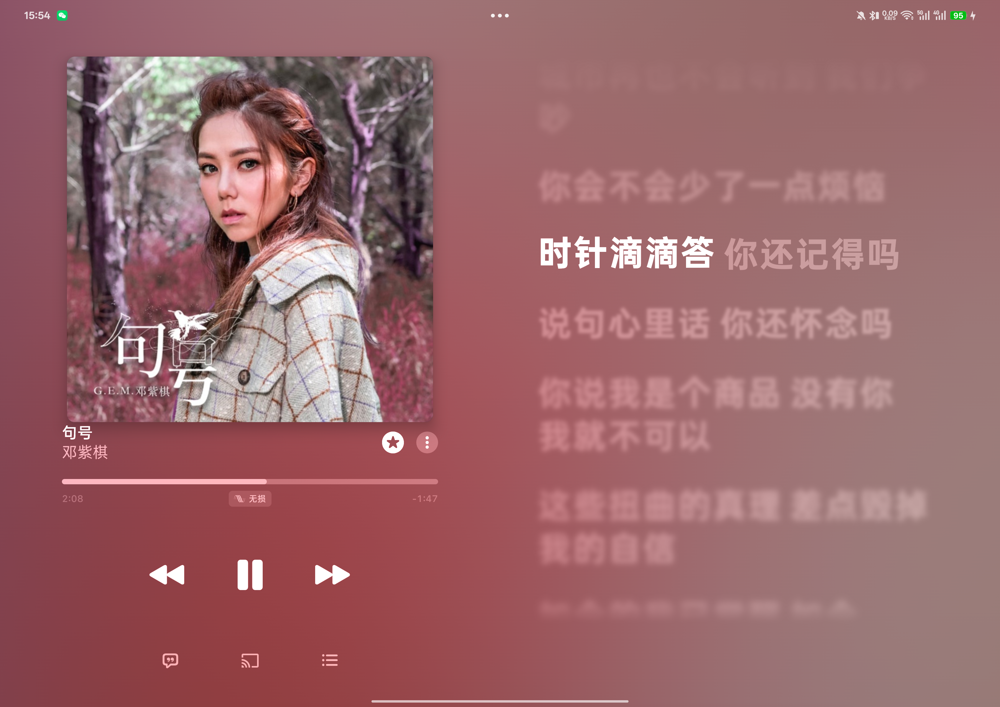
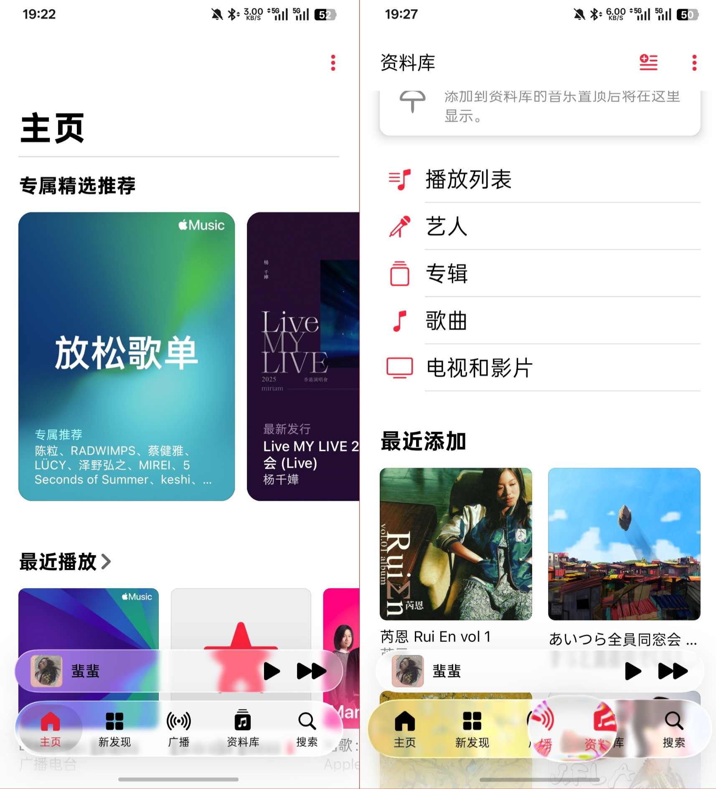

# AM++

AM++ 是面向 libxposed API 102 的 Apple Music 增强模块。目前主要针对 Apple Music `6.5.0 (1580)` 开发并完成真机验证。

## 功能

| 功能 | 默认状态 | 生效范围 | 稳定性 |
| --- | --- | --- | --- |
| 平板双栏播放器 | 开启 | Apple Music 官方 `is_tablet=true` 且横屏 | 可用 |
| 平板动态视频抑制 | 开启 | 平板横屏的 Editorial Video | 可用 |
| 双向歌词模糊 | 开启 | Android 12 及以上 | 可用 |
| 手机液态玻璃底栏 | 关闭 | Apple Music 官方 `is_tablet=false` | **WIP** |
| 隐藏启动器图标 | 关闭 | AM++ 设置应用 | 可用 |

手机液态玻璃会为底部导航栏和迷你播放器增加实时背景模糊、半透明材质与选中项胶囊。该功能仍可能在冷启动或全屏播放器收回时出现单帧闪烁，因此默认关闭并统一标记为 WIP。

双向歌词模糊方案移植并适配自 [a23bc/amlyricblur](https://github.com/a23bc/amlyricblur)

## 平板双栏播放器演示

<p align="center">
  
</p>

在 Apple Music 官方识别为平板的横屏布局中，播放器以左侧专辑封面与播放控制、右侧实时歌词的双栏形式显示。该功能默认开启。

## 液态玻璃演示（WIP）

<p align="center">
  
</p>

> [!WARNING]
> 这玩意纯纯半成品，bug多得离谱，截个图还是ok的

非常欢迎大家提交 Issue 和 Pull Request，共同完善液态玻璃功能。

提交 PR 前请至少运行 `test`、`lintVitalRelease` 和 `assembleRelease`，并在涉及界面行为时附上设备、系统版本和验证截图或录屏。

## 环境要求

- Android 8.0（API 26）或更高版本；
- 实际支持 libxposed API 102 和 remote preferences 的 Xposed 框架；
- Apple Music。当前验证版本为 `6.5.0 (1580)`，其他版本不保证兼容。

旧版 LSPosed 1.9.x 的 API 100 运行时无法加载本模块。判断兼容性时应以框架核心报告的 API 版本为准，而不是只看 Manager 应用版本。

## 安装

1. 安装 release APK。
2. 在 LSPosed 中启用 **AM++**。
3. 仅选择 Apple Music（`com.apple.android.music`）作为作用域。
4. 强制停止并重新打开 Apple Music。
5. 从桌面打开模块设置页，根据需要调整功能。隐藏启动器图标后，可从 LSPosed 的模块详情重新打开设置。

Apple Music 功能修改后需要强制停止并重新打开目标应用。设置页显示“已连接 LSPosed API 102”后才能写入框架托管的 remote preferences；隐藏启动器图标是本地组件设置，不依赖该连接。

## 从源码构建

需要 JDK 17、Android SDK 37 和 Build Tools 37.0.0。项目自带 Gradle Wrapper：

```powershell
.\gradlew.bat test lintVitalRelease assembleRelease
```

Linux 或 macOS：

```bash
chmod +x gradlew
./gradlew test lintVitalRelease assembleRelease
```

生成的 APK 位于：

```text
app/build/outputs/apk/release/app-release.apk
```

正式 Release 使用项目专用签名。首次在本地构建时，将 `keystore.properties.example` 复制为被 Git 忽略的 `keystore.properties`，填写 keystore 路径、密码与别名；未提供签名配置时仍可构建 Debug APK，但不能生成可发布的正式签名产物。GitHub Actions 的签名材料保存在仓库 Secrets 中，工作流会拒绝上传 Android debug 证书签名的 APK。

## 实现说明

- 模块入口使用 libxposed `XposedModule/onPackageReady`。
- 配置由 `libxposed/service` 写入 remote preferences，Apple Music 注入进程只读。
- API 102 不再提供旧式资源 Hook，因此布局接入通过受限的 `LayoutInflater.inflate` 拦截和布局根节点识别完成。
- 各项功能独立定位、独立降级；某一组 Hook 定位失败时不应阻止其他功能加载。
- 平板判定直接读取 Apple Music 的 `bool/is_tablet`，不使用模块自定义屏幕宽度阈值。
- 双向歌词模糊核心来自 [a23bc/amlyricblur](https://github.com/a23bc/amlyricblur)，模块负责版本定位、配置开关、libxposed API 102 接入与渲染热路径优化。

## 隐私与安全

模块不请求网络、存储或通知权限，也不包含分析服务。Apple Music 功能设置保存在 Xposed 框架管理的 remote preferences 中；启动器图标状态由 Android PackageManager 本地保存。模块不自行暴露配置 Provider、广播接收器或跨应用写入接口。`libxposed/service` 依赖会注册其框架连接所需的 `XposedProvider`。

## 项目结构

```text
app/src/main/java/      模块入口、配置与功能实现
app/src/main/resources/ libxposed 模块元数据和作用域
app/src/test/           JVM 与结构回归测试
docs/adr/               当前架构决策记录
scripts/                可选的真机回归与录屏分析脚本
```

`scripts/` 中的真机脚本需要 ADB，部分液态玻璃录屏检查还需要 root、Python、OpenCV，并针对 1080 × 2376 的验证设备坐标编写。运行前通过 `-Serial`/`-Device` 参数或 `ANDROID_SERIAL` 环境变量指定设备。

## 已知限制

- Apple Music 内部类和资源会随版本混淆、调整，升级 Apple Music 后可能需要重新适配。
- 手机液态玻璃为 WIP，不应视为稳定功能。
- 功能开关不会热卸载已安装到当前 Apple Music Activity 的界面修改；修改后应重启目标应用。

第三方代码与依赖许可见 [THIRD_PARTY_NOTICES.md](THIRD_PARTY_NOTICES.md)。

## 开源许可

本项目以 [MIT License](LICENSE) 开源。第三方代码与依赖仍分别遵循其原始许可。
